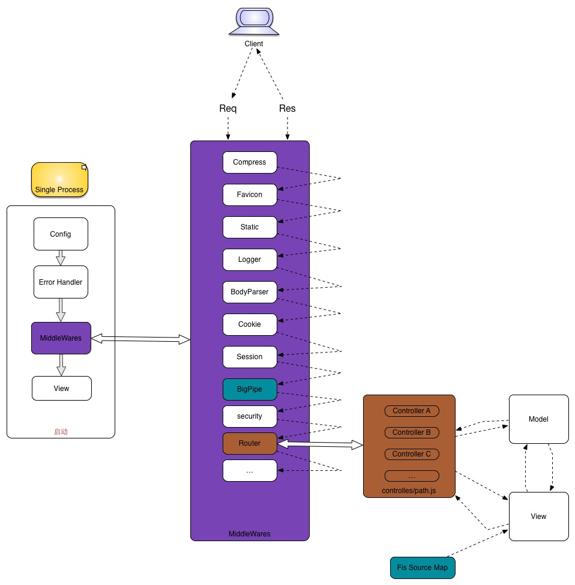
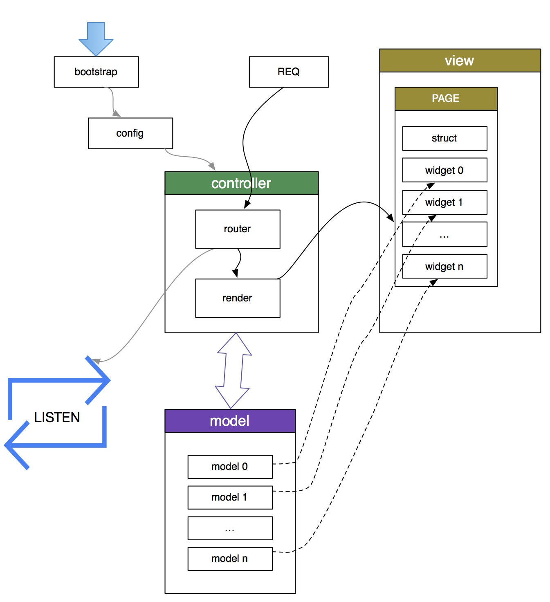

Yogurt [ˈjoɡət]
======================

针对后端为 [express.js](http://expressjs.com/) 的 F.I.S 前后端开发规范设计文档。

整体开发分两个流程，前端开发与后端开发。前端开发主要集中在 html 和 js 的编写上，所有页面和数据通过 fis 模拟协助快速开发。后端开发主要集中在模板渲染和提供数据等逻辑上。

采用前后端分离主要考虑能更好的分工合作，同时通过页面与数据模拟可以大大的减少前端开发成本，达到快速开发的效果。

## 目录

* [前端篇](#前端篇)
    - [目录规范](#目录规范)
    - [模板](#模板)
    - [Widget 模块化](#widget-模块化)
* [后端篇](#后端篇)
    - [目录规范](#目录规范-1)
    - [Workflow](#workflow)
    - [Fis 静态资源定位](#fis-静态资源定位)
    - [Router & Controllers](#router--controllers)
    - [BigPipe](#bigPipe)

## 前端篇

### 目录规范

```bash
├── page                    # 页面 tpl
├── static                  # 静态资源
├── widget                  # 各类组件
├── test                    # 数据与页面模拟目录
├── fis-conf.js             # fis 编译配置
```

### 模板

基于 [swig](http://paularmstrong.github.io/swig/) 扩展 html、head、body、style、script、require、uri、widget 等标签，方便组织代码和静态资源引用，自动完成 js、css 优化输出。

layout.html

```tpl
<!doctype html>

    
        <meta charset="UTF-8">
        <title></title>
        
        
        
        
            body { color: white;}
        
        
        
            console.log('hello yogurt');
        
    
    

    
        <div id="wrap">
            
            This will be override.
            
        </div>
    

```

index.html

```tpl



<p>This is just an awesome page.</p>

```

### Widget 模块化

页面中通用且独立的小部分可以通过 widget 分离出来，方便维护。

widget/header/header.html

```html
<div class="header">
    <ul>
        <li>nav 1</li>
        <li>nav 2</li>
    </ul>
</div>
```

page/index.html

```tpl



    

```

### Widget 渲染模式

借鉴了 BigPipe，Quickling 等思路，让 widget 可以以多种模式渲染。

1. `sync` 默认就是此模式，直接输出。
2. `quicking` 此类 widget 在输出时，只会输出个壳子，内容由用户自行决定通过 js，另起请求完成填充，包括静态资源加载。
3. `async` 此类 widget 在输出时，也只会输出个壳子，但是内容在 body 输出完后，chunk 输出 js 自动填充。widget 将忽略顺序，谁先准备好，谁先输出。
4. `pipeline` 与 `async` 基本相同，只是它会严格按顺序输出。

```tpl



    

```

## 后端篇

### 目录规范

```bash
├── config                    # 配置文件
│   ├── UI-A-map.json         # 静态资源表。
│   ├── UI-B-map.json         # 静态资源表。
│   ├── config.json           # 默认配置
│   └── development.json      # 开发期配置项，便于调试。
├── controllers               # 控制器
│   └── ...                   # routes
├── locales                   # 多语言
├── models                    # model
│   └── ...
├── public
│   │── UI-A                  # UI-A 的所有静态资源
│   │   └── ...
│   └── UI-B                  # UI-B 的所有静态资源
│       └── ...
├── views
│   │── UI-A                  # UI-A 的模板文件。
│   │   └── ...
│   └── UI-B                  # UI-B 的模板文件。
│       └── ...
└── server.js                 # server 入口
```

###  Workflow

node express 服务端处理流程与 php 处理流程有很大的区别。php 借助其他服务器，通过 cgi 的方式运行，在 cgi 那层已经把一些常用的功能集成好了，在 php 脚本那层直接就可以使用，如 cookie, session 和表单数据解析等等。而 node 则需要自行开起服务，同时对于 http 请求的各种处理都需要自己处理，不过没关系，有强大的社区做支持，有很多现成中间件。



**中间件说明**

* `compress` gzip 传输内容。
* `favicon` 其实就是一个静态文件，跟 `static` 分开是因为它可以做更长的缓存。
* `static` 设定静态目录，处理静态文件。
* `logger` 对 http 请求做日志记录。
* `bodyparser` 对不同的发送方式做解析，如：form-data, multipart, json.
* `cookie` 解析 cookie 数据，方便后续 app 使用。
* `session` 类似于 `cookie`, 数据存储于服务端。
* `security` 做服务端安全处理，防止入侵。
* `Fis Source Map`  解析前端模块生成的静态资源表，帮助后续 app 定位静态资源。
* `i18n` 多语言数据读取，帮助后续 app 或模板对多语言的支持。
* `BigPipe` 帮助后续 app 和 view 层实现快速渲染功能。
* `Router` 分组多种路由，集成在独立的特定文件上维护。

### Fis 静态资源定位

集成在模板引擎中，通过使用扩展的 custom tags 便能正确的资源定位。此功能主要依赖与前端模块生成的静态资源表。借助静态资源表，我们可以简单的实现将静态资源部署在 cdn 或者其他服务器上。

### Router & Controllers

主要起到一个组的概念，将多个路由，按照相同的前缀分类。

比如原来你可能需要这么写。

```javascript
app.get('/user', function(req, res, next) {
    res.render('user/list.tpl', data);
});

app.get('/user/add', function(req, res, next) {
    // todo
});

app.get('/user/edit/:id', function(req, res, next) {
    // todo
});

app.get('/user/read/:id', function(req, res, next) {
    // todo
});
```

此 router 中间件可以让你把 user 操作的一系列路由，组合写在一个 user.js 文件里面，效果与上面代码完全相同。

controllers/user.js

```javascript
module.exports = function(router) {
    router.get('/list', function(req, res, next) {
        // todo
    });

    router.get('/add', function(req, res, next) {
        // todo
    });

    router.get('/edit/:id', function(req, res, next) {
        // todo
    });

    router.get('/read/:id', function(req, res, next) {
        // todo
    });
};
```

### BigPipe



为了更快速的呈现页面, 可以让页面整体框架先渲染，后续再填充内容。更多请查看[widget 渲染模式](#widget 渲染模式)。

其实对于页面渲染过程中，会拖慢渲染的主要是 model 层数据获取。传统的渲染模式 `res.render(tpl, data)`, 都是先把数据都准备好了才开始渲染，这样浏览器需要等待很长一段时间才能呈现页面。

现在的方式是 `res.render()` 只需准备框架必要的数据，chunk 输出框架内容，浏览器便能先呈现一个轮廓，后续接着获取 widget 数据，等数据 ready chunk 补充渲染 widget。这样便能减少用户的等待时间。

```javascript
router.get('/', function(req, res) {
   
   var frameModel = {
       title: 'xxxx',
       navs: [{}, {}]
    };

    req.bigpipe

        // 绑定 pagelet 数据提供回调。
        .bind('pageletId', function(done) {
            // 此方法会在 widget 渲染前触发。
            // 而 widget 可能会在 body 输出完后开始渲染，
            // 也可能会在下次请求的时候开始渲染，
            // 具体根据 widget 所选择的渲染模式决定。

            var user = new User();
        
            user.fetch();

            user.then(function(value) {
                done(value);
            });
        })
        .render('user.tpl', frameModel);
});
```
除了在 controller 中关联数据提供者外，还可在模板层，通过配置与 model 自动关联。

```tpl
...

...
```

所有的 models 都统一放在 `modules` 目录下面, 通过指定 path 便能与 model 关联上。